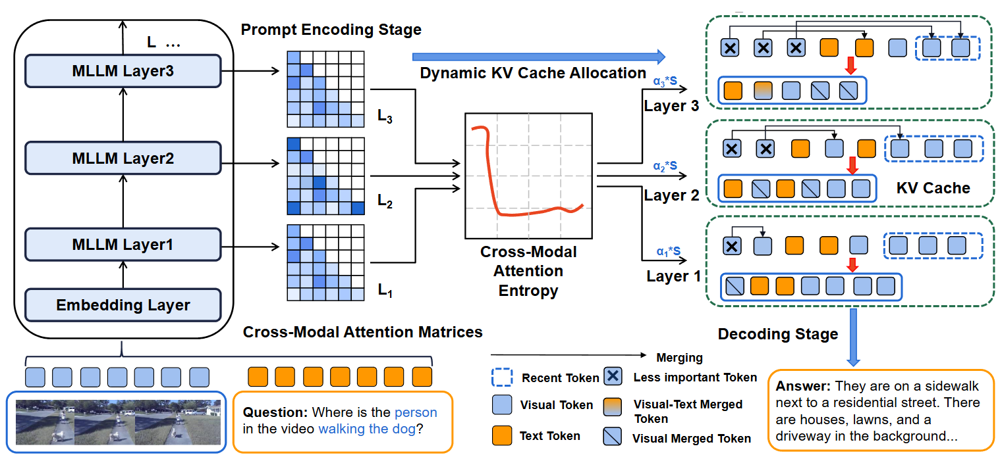

# MEDA: Dynamic KV Cache Allocation for Efficient Multimodal Long-Context Inference

<div align="center">
 <br>
</div>


The code for NAACL 2025 paper: [$D_{2}O$: MEDA: Dynamic KV Cache Allocation for Efficient Multimodal Long-Context Inference](https://openreview.net/forum?id=HzBfoUdjHt).
<p align="center">
  📃 <a href="https://arxiv.org/abs/2502.17599" target="_blank">[Paper]</a> • 💻 <a href="https://github.com/AIoT-MLSys-Lab/MEDA" target="_blank">[Github]</a> 
</p>
<h5 align="center"> If you find our project helpful, please give us a star ⭐ on GitHub to stay updated.</h5>


## Quick Step to Setup Environment
We recommend using Anaconda to create a new environment and install the required packages. You can create a new environment and install the required packages using the following commands:
```bash

conda create -n meda python=3.10
conda activate meda
pip install -r requirements.txt
pip install --upgrade pip  
```
## Quick Step to Run the Code
You can run the inference code using the following command to run the Longbench sample:
```bash
cd Dynamic-MLLMs
bash download_dataset.sh
bash ./scripts/meda_eval.sh
```
  
For tasks related to video tasks of `lm-evaluation-harness` [GitHub Repository](https://github.com/EvolvingLMMs-Lab/lmms-eval),  
we recommend using the latest version by running:  

```bash
git clone https://github.com/EvolvingLMMs-Lab/lmms-eval.git
```
Then, follow the installation instructions provided in the repository.

## Citation
```bibtex
@article{wan2025meda,
  title={MEDA: Dynamic KV Cache Allocation for Efficient Multimodal Long-Context Inference},
  author={Wan, Zhongwei and Shen, Hui and Wang, Xin and Liu, Che and Mai, Zheda and Zhang, Mi},
  journal={arXiv preprint arXiv:2502.17599},
  year={2025}
}
```
